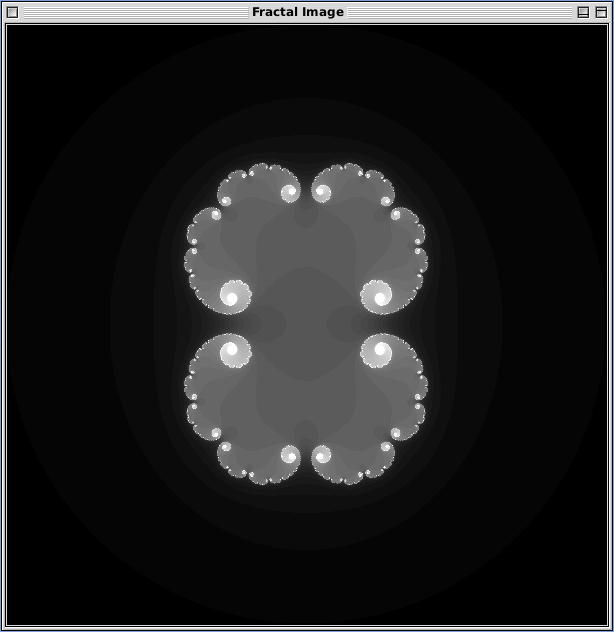
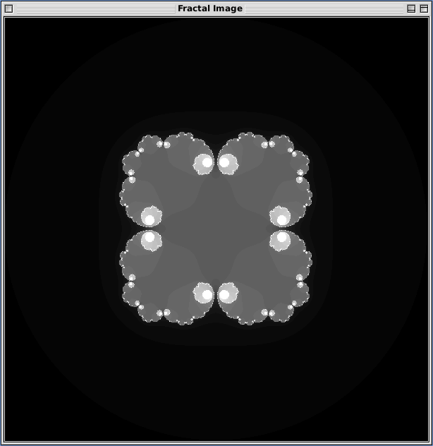
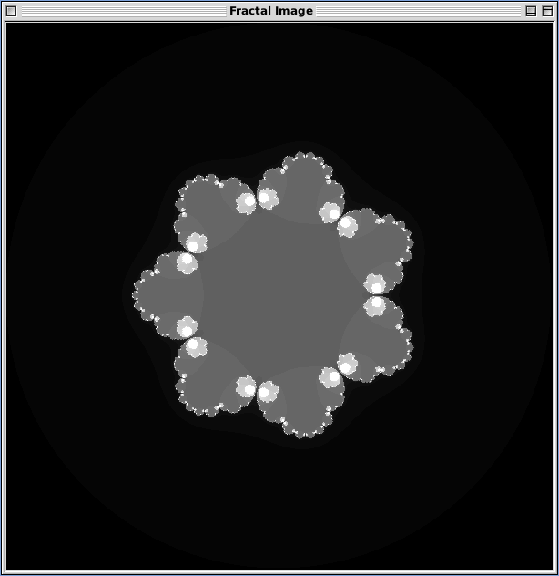

# Fractals

## Generic Python code for generating and exploring fractals

I have a lot of repos on Github for generating Mandelbrot sets (e.g. [various languages](https://github.com/owainkenwayucl/mandel), [OpenWatcom Fortran 77 for DOS](https://github.com/owainkenwayucl/mandel77), [FreeBASIC](https://github.com/owainkenwayucl/mandbas)) but those implementations have very rigidly stuck to a fairly inflexible way of doing things, don't use built in complext types etc.  The code in this repository for Python is designed to be a lot more flexible (but probably a lot slower) to test out some concepts for doing things.

## Goals

 * generic to do more than Mandelbrot, e.g. Julia sets [done]
 * use complex types [done]
 * use numpy where possible [ongoing]
 * graphical [done] and image output
 * parallelisation

 ## Examples

 If you look in `mandelbrot.py` you will see a fairly normal Mandelbrot example.

 ```python
import fractals

fractals.show_image(fractals.generate_fractal(600,400, fractals.mandel, max_iter=50))
 ```

 This example illustrates where I am trying to go - you generically show an image based on the output of a procedure that generates a fractal image of a given size given a function (in this case the one for the Mandelbrot set) and a number of iterations (optional).


If you look in `julia.py` you can see an example which generates and displays one after another the example Julia sets shown on [Wikipedia](https://en.wikipedia.org/wiki/Julia_set#Examples_of_Julia_sets).

```python
import fractals

# Generate julia sets as per https://en.wikipedia.org/wiki/Julia_set#Examples_of_Julia_sets

n = 2
c = [0.279, 0.400, 0.484, 0.544, 0.590, 0.626]
for i in c: 
    j = fractals.generate_julia(i,n)
    fractals.show_image(fractals.generate_fractal(600,600, j, max_iter=50, xmin=-2.0, xmax=2.0, ymin=-2.0, ymax=2.0))
    n += 1
```

Here we can see an example where in order to allow arbitrary values in Julia functions, I have implemented a generic function `fractals.julia` and then written `fractals.generate_julia` which takes values of *c* and *n* and generates and returns an anonymous function based on `fractals.julia` which is based on those values so that it may be safely passed to `fractals.generate_fractal`.






